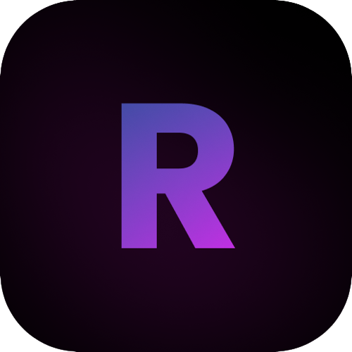

  

    Enable your reading superpower.

## What is Reedee?

> **Reedee is under active development.** 

Reedee is a blazing fast PDF reader, all you have to do is upload the PDF document, and Reedee will take care of the rest.

# Reedee 📚

Reedee is a modern application built using Next.js and React Query. The tech stack includes other notable libraries and tools such as Tailwind CSS, Radix UI, and Framer Motion.

## Tech Stack 🛠️

- 🚀 [Next.js](https://nextjs.org/)
- 🌴 [React Query](https://react-query.tanstack.com/)
- 🎨 [Tailwind CSS](https://tailwindcss.com/)
- 🖌️ [Shadcn/ui](https://ui.shadcn.com/)
- 🎬 [Framer Motion](https://www.framer.com/api/motion/)

## Features 🌟

- User-friendly interface for browsing and interacting with documents.
- Audio playback for reading aloud functionality.
- Customizable settings for appearance and typography.
- Progressive Web App (PWA) support.
- AI page summarization and takeaways.

## To-Do ✅

- [ ] AI generated page summaries and takeaways
- [x] Add audio playback functionality
- [ ] Chrome cast for PDF file sharing
- [ ] Add offline support
- [ ] Support for Google Assistant voice summarization commands

## Contributing 🤝

Contributions, issues, and feature requests are welcome! Feel free to check the [issues page](https://github.com/dalist1/reedee/issues) for open issues and what needs to be done.

## License 📝

This project is [MIT](LICENSE) licensed.

## Show your support 💪

Give a ⭐️ if you like this project!
